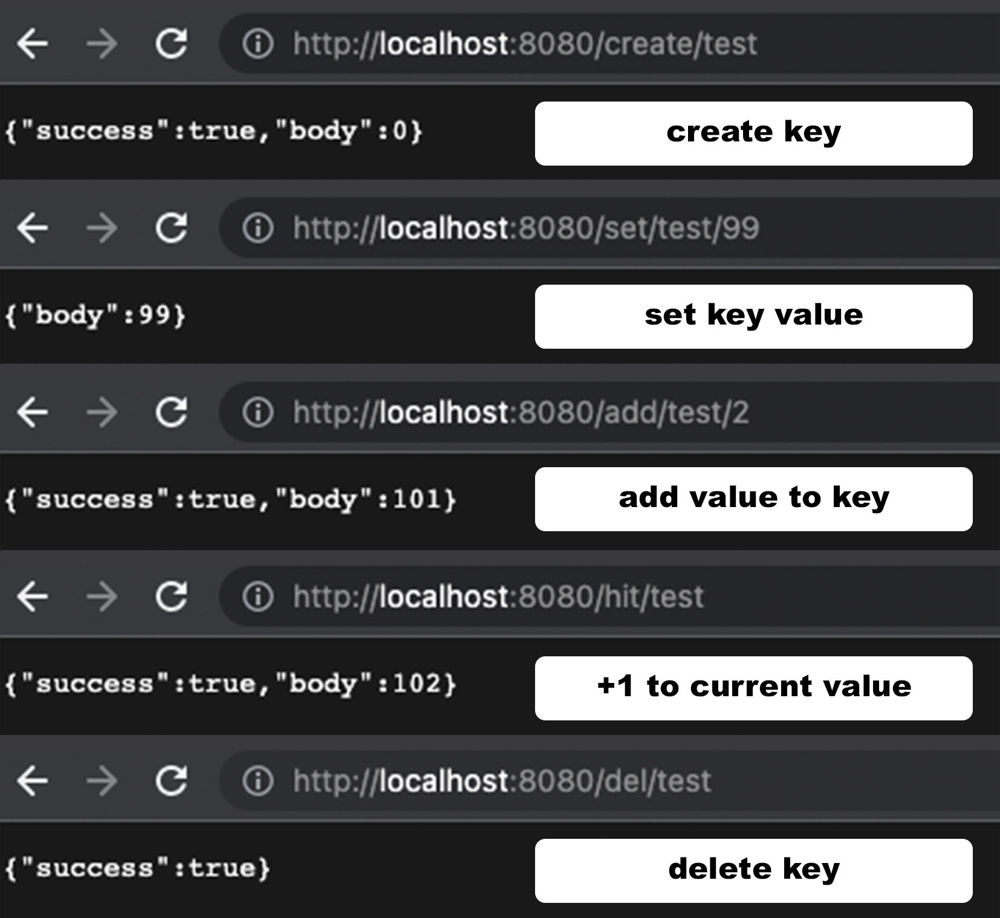
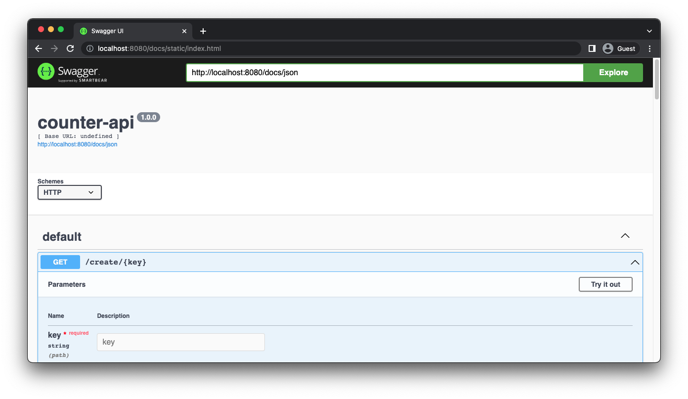

# Counter API

<p align="center">
  
</p>

Counter API is a service for creating counters, created on the basis of the Redis database.

## Usage
Install dependencies:

```bash
  yarn install
```

Running app with Docker
```bash
  docker-compose up -d --build
```
App uses the Redis database

The URL of the database is specified in `docker-compose.yml`

```javascript
    environment:
      db: Your DB URL
      port: 8080
    ports:
      - 8080:8080
```

## API Reference
To describe endpoints, we use [Swagger](https://swagger.io/)

SwaggerUI is available via
```http
  GET /docs
```
<p align="center">
  
</p>

#### Create a counter

```http
  GET /create/key
```

| Parameter | Type     | Description                |
| :-------- | :------- | :------------------------- |
|   `key` | `string` | **Required**. Counter name |


#### Set key value

```http
  GET /set/key/value
```

| Parameter | Type     | Description                       |
| :-------- | :------- | :-------------------------------- |
| `key`      | `string` | **Required**. Counter name |
|   `value` | `number` | **Required**. Value to set (Default value: 0) |

#### Add number to current value in counter

```http
  GET /add/key/value
```

| Parameter | Type     | Description                       |
| :-------- | :------- | :-------------------------------- |
| `key`      | `string` | **Required**. Counter name |
|   `value` | `number` | **Required**. Value to add |


#### Hit 

Adds 1 to the current number in the counter
```http
  GET /hit/key
```

| Parameter | Type     | Description                       |
| :-------- | :------- | :-------------------------------- |
| `key`      | `string` | **Required**. Counter name |

#### Delete

Deletes the counter

```http
  GET /hit/key
```

| Parameter | Type     | Description                       |
| :-------- | :------- | :-------------------------------- |
| `key`      | `string` | **Required**. Counter name |

##